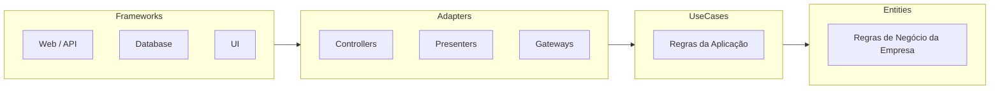

# Architecture Patterns — Manual Operacional

Manual denso de padrões arquiteturais para sistemas de produção. Cada padrão com: quando usar, quando NÃO usar, trade-offs quantificados, diagrama e checklist de implementação.

## Quando usar

- Projetar arquitetura de sistema novo (SaaS, API, microserviços).
- Refatorar sistema existente (monolito → modular, modular → microserviços).
- Documentar decisões arquiteturais (ADRs).
- Escolher entre padrões concorrentes (Clean vs Hexagonal, REST vs Event-Driven, Monolito vs Microserviços).

**Pule** para `principal-engineer` para governança cross-team; `staff-engineer` para liderança técnica transversal; `cloud-infra` para IaC e deploy.

---

## Matriz de Decisão: Qual Padrão Usar

| Cenário | Padrão recomendado | NÃO usar | Trade-off principal |
|---|---|---|---|
| CRUD simples, time pequeno (1-3 devs) | **Monolito Modular** | Microserviços | Simplicidade vs escalabilidade independente |
| Domínio complexo com regras de negócio densas | **DDD + Clean Architecture** | CRUD genérico | Modelagem rica vs overhead de abstrações |
| Leitura e escrita com perfis muito diferentes | **CQRS** | CQRS em CRUD simples | Performance de leitura vs complexidade |
| Auditoria completa, replay de estado | **Event Sourcing** | Domínios sem necessidade de auditoria | Rastreabilidade vs complexidade de queries |
| Múltiplos times, deploy independente | **Microserviços** | Monolito sem dor | Autonomia de times vs complexidade operacional |
| Integração entre sistemas heterogêneos | **Event-Driven (Pub/Sub)** | Chamadas síncronas ponto-a-ponto | Desacoplamento vs eventual consistency |
| Testabilidade e troca de infra sem reescrever | **Hexagonal (Ports & Adapters)** | Código sem fronteira clara | Testabilidade vs boilerplate de interfaces |

---

## Clean Architecture (Robert C. Martin)



### Dependency Rule (inviolável)

- Dependências apontam **para dentro** (Frameworks → Adapters → UseCases → Entities).
- Camadas internas **NUNCA** importam de camadas externas.
- Inversão de dependência: camadas internas definem interfaces (ports), camadas externas implementam (adapters).

### Estrutura de diretórios (Next.js/Node)

```
src/
├── domain/           # Entities + Value Objects (zero deps externas)
│   ├── entities/
│   └── value-objects/
├── application/      # Use Cases + Ports (interfaces)
│   ├── use-cases/
│   └── ports/
├── infrastructure/   # Adapters (DB, API, Email, Queue)
│   ├── database/
│   ├── http/
│   └── services/
└── presentation/     # Controllers, Routes, UI Components
    ├── api/
    └── components/
```

### Checklist

- [ ] Entities sem imports de frameworks (React, Express, Prisma)
- [ ] Use Cases recebem ports (interfaces) via injeção de dependência
- [ ] Database adapter implementa interface definida em `ports/`
- [ ] Testes de use cases não precisam de banco real (mock do adapter)

---

## Hexagonal Architecture (Ports & Adapters)

```
         ┌──────────────┐
  HTTP ─→│ Adapter (In) │──→ Port (In) ─→ ┌──────────────┐
  CLI ──→│              │                  │  Core Logic  │ ─→ Port (Out) ─→│ Adapter (Out)│─→ DB
  Queue →│              │                  │  (domain)    │                  │              │─→ API
         └──────────────┘                  └──────────────┘                  └──────────────┘
```

### Regras

1. **Core puro**: Regras de negócio sem NENHUMA dependência externa (nem framework, nem banco, nem HTTP).
2. **Ports = interfaces**: O core define contratos (`UserRepository`, `EmailSender`). Adapters implementam.
3. **Adapters trocáveis**: Trocar PostgreSQL por MongoDB = trocar só o adapter, sem tocar no core.
4. **Testabilidade**: Core testável com mocks dos ports. Zero infra nos testes unitários.

---

## DDD (Domain-Driven Design)

### Building Blocks

| Conceito | O que é | Exemplo |
|---|---|---|
| **Entity** | Objeto com identidade (ID) que persiste | `User`, `Order`, `Product` |
| **Value Object** | Objeto sem ID, definido por atributos | `Email`, `Money`, `Address` |
| **Aggregate** | Cluster de entities com raiz (Aggregate Root) | `Order` (raiz) + `OrderItem` + `Shipping` |
| **Repository** | Interface para persistir/recuperar Aggregates | `UserRepository.findById(id)` |
| **Domain Service** | Lógica que não pertence a nenhuma entity | `PricingService.calculateDiscount()` |
| **Domain Event** | Fato que ocorreu no domínio | `OrderPlaced`, `PaymentConfirmed` |
| **Bounded Context** | Fronteira onde um modelo de domínio tem significado | "Vendas" vs "Logística" vs "Faturamento" |

### Regras rígidas

1. **Aggregate Root**: Acesso externo ao aggregate SÓ pela raiz. `OrderItem` nunca é acessado diretamente.
2. **Bounded Context**: Mesmo termo pode significar coisas diferentes em contextos diferentes. `User` em "Auth" ≠ `User` em "Billing".
3. **Ubiquitous Language**: Código usa os mesmos termos que o negócio. Se o negócio diz "Pedido", o código tem `Order`, não `Transaction`.

---

## CQRS (Command Query Responsibility Segregation)

```
Command (Write): Command → Handler → Aggregate → Event Store / Write DB
Query (Read):    Query → Handler → Read Model (denormalized) → Response
```

### Quando usar vs NÃO usar

| Usar | NÃO usar |
|---|---|
| Leitura 100x mais frequente que escrita | CRUD simples sem complexidade |
| Modelos de leitura e escrita muito diferentes | Time pequeno (1-3 devs) sem ganho |
| Performance de leitura crítica (dashboard, search) | Consistência forte obrigatória |
| Auditoria e replay de estado (Event Sourcing) | Dados efêmeros sem valor histórico |

---

## Event-Driven Architecture

### Tipos de evento

| Tipo | Conteúdo | Quando |
|---|---|---|
| **Event Notification** | "Algo aconteceu", sem dados | Desacoplamento máximo, consumidor busca dados |
| **Event-Carried State Transfer** | Evento COM dados completos | Consumidor não precisa buscar dados adicionais |
| **Command** | Intenção de fazer algo | Orquestração (pedir para outro serviço agir) |

### Padrões de resiliência

| Padrão | Problema que resolve | Implementação |
|---|---|---|
| **Outbox Pattern** | Garantir que evento é publicado quando DB é commitada | Salvar evento em tabela `outbox` (mesmo schema/transaction do domínio) e publicar via processo separado com ID único para dedupe. Baixa vazão: polling da tabela. Alta vazão em produção: substituir polling por **CDC** (Change Data Capture, ex. **Debezium**) lendo o write-ahead log |
| **Saga Pattern** | Transação distribuída entre serviços | **Coreografia** (cada serviço reage a eventos que observa — simples em pequena escala) ou **Orquestração** (um coordenador emite comandos e reage a respostas — mais fácil de raciocinar conforme a saga cresce); sequência de eventos compensatórios (rollback por evento) |
| **Dead Letter Queue** | Eventos que falharam N vezes | Mover para fila separada para análise manual |
| **Idempotency** | Processamento duplicado de evento | Chave de idempotência por evento (deduplicate by ID) |

**Regra de introdução incremental**: comece com Pub/Sub simples publicando poucos eventos de domínio de alto valor; adicione outbox transacional antes de qualquer saga; só introduza saga onde o workflow de fato atravessa múltiplos serviços. Camadas (event sourcing, CQRS, saga) só valem a complexidade quando o sistema realmente precisa — não big-bang.

---

## Microservices

**Diretriz 2026 (heurística de mercado, não regra absoluta)**: comece com monolito modular. Migrar para microserviços só se justifica ao ultrapassar de forma sustentada a ordem de **~1M requisições/dia** ou **~50+ desenvolvedores** competindo pelo mesmo deploy — abaixo disso, o overhead operacional (observabilidade distribuída, deploy independente, versionamento de contrato) normalmente supera o ganho. Sem **bounded contexts** de DDD definindo as fronteiras primeiro, microserviços viram "distributed big ball of mud": serviços separados na infra, mas acoplados no domínio.

### Quando migrar de monolito

| Sinal | Indica |
|---|---|
| Deploy de um módulo bloqueia outro | Boundary violation |
| Times esperando merge um do outro | Conway's Law não respeitada |
| Escalabilidade diferente por módulo | Resource isolation necessário |
| Tecnologias diferentes por domínio | Polyglot obrigatório |

### Anti-padrões de microserviços (NUNCA)

| Anti-padrão | Consequência |
|---|---|
| **Distributed Monolith** | Microserviços acoplados que deployam juntos — pior dos dois mundos |
| **Shared Database** | Acoplamento de schema entre serviços — não escala |
| **Sync Chain** | A → B → C → D síncrono — latência acumulada, falha cascata |
| **Nano Services** | Serviços tão pequenos que o overhead de comunicação domina |

---

## ADRs (Architecture Decision Records)

### Template

```markdown
# ADR-NNN: [Título da Decisão]

**Status**: proposed | accepted | deprecated | superseded by ADR-NNN
**Data**: AAAA-MM-DD
**Decisores**: [nomes]

## Contexto
[Qual problema estamos resolvendo? Que restrições existem?]

## Decisão
[O que decidimos fazer e por quê.]

## Alternativas Consideradas
| Alternativa | Prós | Contras |
|---|---|---|
| Opção A | ... | ... |
| Opção B (escolhida) | ... | ... |

## Consequências
- **Positivas**: [benefícios concretos]
- **Negativas**: [trade-offs aceitos]
- **Riscos**: [o que pode dar errado]
```

### Regras de ADR

1. ADRs são **imutáveis** após aceitos. Para mudar, crie novo ADR que "supersedes" o antigo.
2. Todo ADR tem **status** e **data**.
3. ADRs vivem no repositório (versionados com o código): `docs/adr/` ou `.agents/memoria/decisoes.md` para decisões leves.

---

## Composição com outras skills

- **Antes**: `brainstorming` (definir requisitos), `requirement-analyzer` (decompor)
- **Durante**: `principal-engineer` (governança), `sequence-diagram-builder` (fluxos)
- **Depois**: `task-planner` (decompor em tarefas), `technical-writer` (documentar)

## References

Veja `references.md` nesta pasta — curadoria dos melhores sites/referências (2026) para este tópico, com as fontes canônicas e exemplos de alto nível.

> Gerado pelo Izanagi AI: cópia fiel de `skills/architecture-patterns/SKILL.md` (fonte da verdade).
