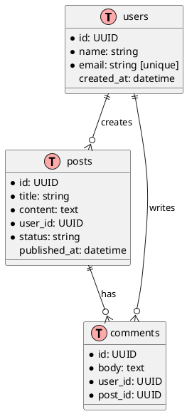
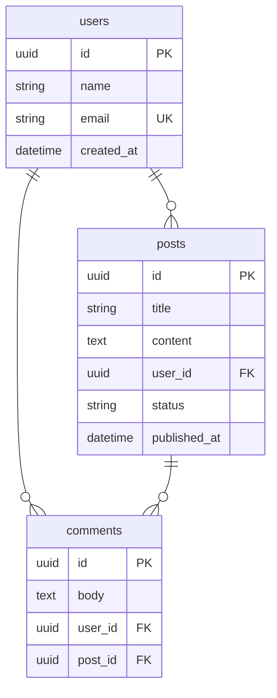

# Skill: ER Diagram Builder

## Identity

ER Diagram Builder generates entity-relationship diagrams from schema definitions or descriptions.

---

## PlantUML ER

---

## Mermaid ER

---

## Changelog

### 1.0.0 — Initial release. PlantUML ER, Mermaid ER.

## References

Veja `references.md` nesta pasta — curadoria dos melhores sites/referências (2026) para este tópico, com as fontes canônicas e exemplos de alto nível.

> Gerado pelo Izanagi AI: cópia fiel de `skills/er-diagram-builder/SKILL.md` (fonte da verdade).
