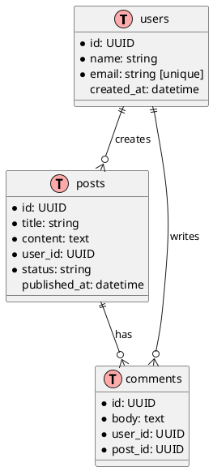
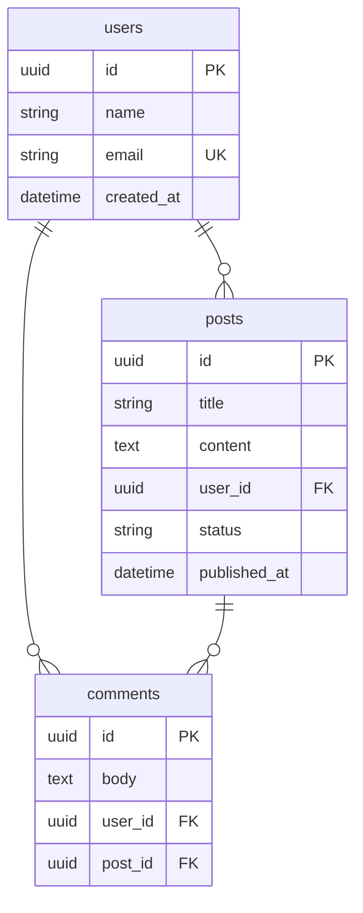

# Skill: ER Diagram Builder

> Migrado deterministicamente de `skills/er-diagram-builder/SKILL.md` (v1) pelo skill-migrator (ADR-004). Corpo original preservado íntegro em **Legacy Reference (v1)**.

## Triggering Criteria

- **Domínio:** Dados (`data`)
- **Resumo:** Gera diagramas entidade-relacionamento (PlantUML, Mermaid) a partir de definições de schema ou descrição do domínio.
- **Ativar quando:** Use ao documentar ou revisar a modelagem de um banco de dados.
- **Escopo canônico:** Skill: ER Diagram Builder
- **Seções do corpo original:** Identity · PlantUML ER · Mermaid ER · Changelog · References
- **Ferramentas MCP esperadas:** mcp:execute_command, mcp:fs_read

## Step-by-Step Workflow

<!-- estratégia de extração: paragraphs-as-steps -->

### Passo 1 — ER Diagram Builder generates entity-relationship diagrams from schema definitions or de...

ER Diagram Builder generates entity-relationship diagrams from schema definitions or descriptions.

### Passo 2 — Veja references.md nesta pasta — curadoria dos melhores sites/referências (2026) para e...

Veja `references.md` nesta pasta — curadoria dos melhores sites/referências (2026) para este tópico, com as fontes canônicas e exemplos de alto nível.

## Verification Steps

<!-- fonte da verificação: fallback-honesto:data -->

- Rodar --dry-run sobre amostra real e comparar o que seria feito com o esperado, linha a linha nas bordas.
- Reconciliar contagens origem → destino (processados, ignorados, falhas com motivo).
- Provar reexecução segura: segunda passada não duplica nem altera resultado.
- Confirmar que nenhum Red Flag (WHERE ausente, PII em log, checkpoint ausente) persiste no pipeline entregue.

## Common Rationalizations

- **"Dados de produção são limpos, validação em lote é paranoia."**
  - Verdade: Produção contém vazio, duplicado, formato legado e outlier desde o primeiro dia. Validação de schema ANTES da carga é o mínimo; assumir limpeza é exportar o bug para o destino.
- **"Registro duplicado é raro, trato se aparecer."**
  - Verdade: Raro em volume alto é frequente em absoluto. Upsert por ID natural/idempotency key é design padrão, não otimização defensiva.
- **"Migro essa base na mão, é uma vez só."**
  - Verdade: 'Uma vez só' executada sob pressão, sem dry-run e sem rollback, é o cenário clássico de perda irreversível. Migração na mão é migração sem verificação.
- **"Índice a gente cria quando a query ficar lenta."**
  - Verdade: Sem índice, a lentidão chega em produção no pico de uso e o índice de emergência trava a tabela justamente no horário crítico. Modelagem inclui acesso previsto.
- **"ETL falhou no meio, rodo do zero que resolve."**
  - Verdade: Recomeçar do zero reprocessa efeito colateral e pode duplicar tudo. Checkpoint é obrigatório: falhou no 643 de 1000, retoma do 644.
- **"PII nesse dataset tá ok porque é ambiente interno."**
  - Verdade: Ambiente interno é o vetor clássico de vazamento (acesso amplo, sem auditoria). Minimização e tratamento de PII aplicam-se onde o dado está, não onde ele 'deveria' estar.

## Red Flags

- DELETE/UPDATE sem WHERE em script operacional (ou com WHERE 'óbvio' não conferido).
- Migração sem path de rollback testado.
- Pipeline batch sem checkpoint — falha no fim recomeça tudo.
- Contagem de registros origem vs destino nunca reconciliada.
- Retry automático em operação não-idempotente sem idempotency key.
- Schema do destino aceitando qualquer coisa (validação adiada indefinidamente).
- PII em log, export ou ambiente compartilhado sem tratamento.

## Legacy Reference (v1)

# Skill: ER Diagram Builder

## Identity

ER Diagram Builder generates entity-relationship diagrams from schema definitions or descriptions.

---

## PlantUML ER

---

## Mermaid ER

---

## Changelog

### 1.0.0 — Initial release. PlantUML ER, Mermaid ER.

## References

Veja `references.md` nesta pasta — curadoria dos melhores sites/referências (2026) para este tópico, com as fontes canônicas e exemplos de alto nível.
