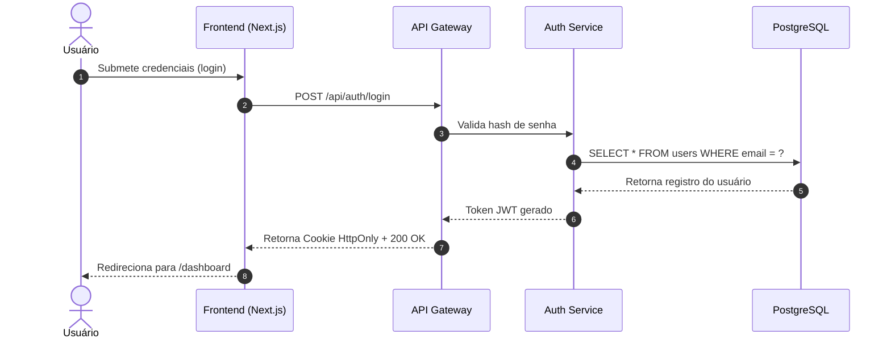

# Sequence Diagram Builder (Diagramas de Sequência via Mermaid)

> Migrado deterministicamente de `skills/sequence-diagram-builder/SKILL.md` (v1) pelo skill-migrator (ADR-004). Corpo original preservado íntegro em **Legacy Reference (v1)**.

## Triggering Criteria

- **Domínio:** Documentação & Comunicação (`docs`)
- **Resumo:** Use para documentar fluxos assíncronos, chamadas de API, autenticação ou integrações entre serviços com diagramas de sequência em Mermaid.js.
- **Ativar quando:** Use para documentar fluxos assíncronos, chamadas de API, autenticação ou integrações entre serviços com diagramas de sequência em Mermaid.js.
- **Escopo canônico:** Sequence Diagram Builder (Diagramas de Sequência via Mermaid)
- **Seções do corpo original:** Quando usar · Sintaxe Padrão Mermaid.js para Sequências · Regras de Ouro para Diagramas Claros · Checklist de qualidade (antes de entregar) · Anti-padrões (proibido)
- **Ferramentas MCP esperadas:** mcp:fs_read, mcp:fs_write

## Step-by-Step Workflow

<!-- estratégia de extração: top-level-ordered -->

### Passo 1 — ❌ Diagramas gigantes e confusos tentando mostrar o sistema inteiro de uma vez

❌ Diagramas gigantes e confusos tentando mostrar o sistema inteiro de uma vez

### Passo 2 — ❌ Participantes fora de ordem cronológica ou lógica

❌ Participantes fora de ordem cronológica ou lógica

### Passo 3 — ❌ Omitir tratamento de erro ou fluxos alternativos quando relevantes

❌ Omitir tratamento de erro ou fluxos alternativos quando relevantes

## Verification Steps

<!-- fonte da verificação: checklist-original -->

- [ ] Diagrama renderiza perfeitamente em leitores de Markdown compatíveis com Mermaid
- [ ] Ordem dos participantes reflete o fluxo real de dados
- [ ] Chamadas (`->>`, linha sólida) e retornos/respostas (`-->>`, linha tracejada) distinguidos corretamente — a linha tracejada indica retorno de mensagem, não necessariamente algo assíncrono
- [ ] Sem poluição visual excessiva (máximo 10-12 passos por diagrama principal)

## Common Rationalizations

- **"Código limpo se auto-documenta, comentário é redundância."**
  - Verdade: Código mostra o COMO, nunca o PORQUÊ nem o contrato de uso. README com instalação/execução/configuração é parte da entrega, não cortesia.
- **"README eu escrevo antes do publish."**
  - Verdade: Antes do publish é depois do esquecimento. Documentação escrita junto à implementação captura decisões que em 3 dias já não estão mais na memória.
- **"Doc envelhece rápido, então melhor nem escrever."**
  - Verdade: Doc desatualizada é corrigível; doc ausente é institucionalizada ignorância. O framework exige limitações conhecidas documentadas — honestidade sobre o que falta é conteúdo, não fraqueza.
- **"Só eu uso esse projeto, documento é overhead."**
  - Verdade: 'Eu daqui a 6 meses' também é outro desenvolvedor. Handoff sem documentação transforma toda manutenção futura em arqueologia.
- **"Coloquei um exemplo genérico no README, serve."**
  - Verdade: Exemplo que não roda é pior que nenhum: ensina errado com autoridade. Todo comando documentado precisa ter sido executado de fato (zero falsificação).
- **"Referência eu completo depois, agora é só chute razoável."**
  - Verdade: URL inventada é alucinação documentada. Nunca entregue referência não verificada — pesquise ou declare explicitamente que não verificou.

## Red Flags

- README sem comando exato de instalação e execução testado.
- `.env.example` ausente num projeto que exige configuração.
- Documentação divergente do comportamento real do código.
- Seção 'Limitações' vazia ou omitida (finge completude).
- Link/referência citada sem verificação (risco de alucinação).
- Termo de domínio usado sem definição numa base nova.

## Legacy Reference (v1)

# Sequence Diagram Builder (Diagramas de Sequência via Mermaid)

Criação de **diagramas de sequência claros e padronizados em Mermaid.js** para ilustrar interações complexas entre atores, frontends, APIs, serviços de backend e bancos de dados.

## Quando usar

Use ao: documentar fluxos de autenticação, pagamentos ou webhooks; explicar interações assíncronas entre microsserviços; desenhar contratos de API antes de codar. **Pule** para: diagramas de arquitetura de infra (skill `cloud-infra` / `architecture-patterns`).

## Sintaxe Padrão Mermaid.js para Sequências

## Regras de Ouro para Diagramas Claros
- **Uso de `autonumber`**: Numera automaticamente os passos para facilitar referências em reuniões ou pull requests.
- **Participantes ordenados**: Da esquerda para a direita na ordem lógica da requisição (Cliente → Gateway → Serviço → Banco).
- **Notas explicativas**: Use blocos `Note over` ou `Note left of` para esclarecer lógica complexa ou regras de negócio em pontos críticos.

## Checklist de qualidade (antes de entregar)
- [ ] Diagrama renderiza perfeitamente em leitores de Markdown compatíveis com Mermaid
- [ ] Ordem dos participantes reflete o fluxo real de dados
- [ ] Chamadas (`->>`, linha sólida) e retornos/respostas (`-->>`, linha tracejada) distinguidos corretamente — a linha tracejada indica retorno de mensagem, não necessariamente algo assíncrono
- [ ] Sem poluição visual excessiva (máximo 10-12 passos por diagrama principal)

## Anti-padrões (proibido)
1. ❌ Diagramas gigantes e confusos tentando mostrar o sistema inteiro de uma vez
2. ❌ Participantes fora de ordem cronológica ou lógica
3. ❌ Omitir tratamento de erro ou fluxos alternativos quando relevantes

## Composição com outras skills
- **Antes**: `architect` (design system) → `requirement-analyzer` (requisitos)
- **Depois**: `technical-writer` (inserção no documento técnico) → `docs` (geração de docs)

## References
- Mermaid.js Sequence Diagrams: https://mermaid.js.org/syntax/sequenceDiagram.html
- Veja `references.md` nesta pasta — curadoria de fontes canônicas (2026).
