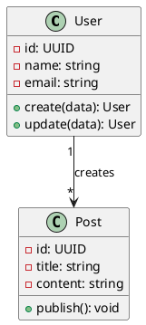
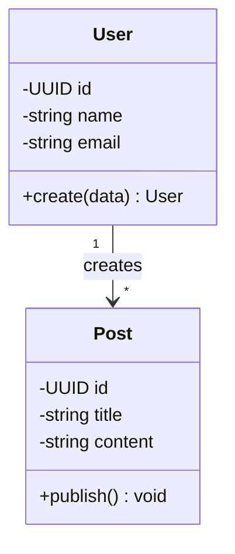

# Skill: UML Generator

> Migrado deterministicamente de `skills/uml-generator/SKILL.md` (v1) pelo skill-migrator (ADR-004). Corpo original preservado íntegro em **Legacy Reference (v1)**.

## Triggering Criteria

- **Domínio:** Documentação & Comunicação (`docs`)
- **Resumo:** Gera diagramas UML (classes, componentes, casos de uso, sequência) em PlantUML ou Mermaid a partir de uma descrição de arquitetura.
- **Ativar quando:** Use ao documentar ou comunicar o design de um sistema.
- **Escopo canônico:** Skill: UML Generator
- **Seções do corpo original:** Identity · Diagram Types · PlantUML Example · Mermaid Example · Changelog
- **Ferramentas MCP esperadas:** mcp:fs_read, mcp:fs_write

## Step-by-Step Workflow

<!-- estratégia de extração: paragraphs-as-steps -->

### Passo 1 — UML Generator produces UML diagrams from architecture descriptions.

UML Generator produces UML diagrams from architecture descriptions. Generates PlantUML or Mermaid.js code for class diagrams, use case diagrams, and component diagrams.

### Passo 2 — Veja references.md nesta pasta — curadoria dos melhores sites/referências (2026) para e...

Veja `references.md` nesta pasta — curadoria dos melhores sites/referências (2026) para este tópico, com as fontes canônicas e exemplos de alto nível.

## Verification Steps

<!-- fonte da verificação: fallback-honesto:docs -->

- Executar literalmente cada comando documentado e confirmar que funciona como escrito (zero falsificação).
- Conferir que instalação, configuração (.env.example), execução e limitações estão presentes e corretas.
- Verificar que nenhuma referência foi citada sem verificação de URL/conteúdo.
- Pedir a uma pessoa externa (ou sessão fresca) que siga o documento e registre onde travou.

## Common Rationalizations

- **"Código limpo se auto-documenta, comentário é redundância."**
  - Verdade: Código mostra o COMO, nunca o PORQUÊ nem o contrato de uso. README com instalação/execução/configuração é parte da entrega, não cortesia.
- **"README eu escrevo antes do publish."**
  - Verdade: Antes do publish é depois do esquecimento. Documentação escrita junto à implementação captura decisões que em 3 dias já não estão mais na memória.
- **"Doc envelhece rápido, então melhor nem escrever."**
  - Verdade: Doc desatualizada é corrigível; doc ausente é institucionalizada ignorância. O framework exige limitações conhecidas documentadas — honestidade sobre o que falta é conteúdo, não fraqueza.
- **"Só eu uso esse projeto, documento é overhead."**
  - Verdade: 'Eu daqui a 6 meses' também é outro desenvolvedor. Handoff sem documentação transforma toda manutenção futura em arqueologia.
- **"Coloquei um exemplo genérico no README, serve."**
  - Verdade: Exemplo que não roda é pior que nenhum: ensina errado com autoridade. Todo comando documentado precisa ter sido executado de fato (zero falsificação).
- **"Referência eu completo depois, agora é só chute razoável."**
  - Verdade: URL inventada é alucinação documentada. Nunca entregue referência não verificada — pesquise ou declare explicitamente que não verificou.

## Red Flags

- README sem comando exato de instalação e execução testado.
- `.env.example` ausente num projeto que exige configuração.
- Documentação divergente do comportamento real do código.
- Seção 'Limitações' vazia ou omitida (finge completude).
- Link/referência citada sem verificação (risco de alucinação).
- Termo de domínio usado sem definição numa base nova.

## Legacy Reference (v1)

# Skill: UML Generator

## Identity

UML Generator produces UML diagrams from architecture descriptions. Generates PlantUML or Mermaid.js code for class diagrams, use case diagrams, and component diagrams.

---

## Diagram Types

```yaml
class_diagram: entities, attributes, methods, relationships
component_diagram: services, controllers, repositories, data flow
use_case: actors, use cases, system boundary
sequence: object interactions, message flow over time
```

---

## PlantUML Example



## Mermaid Example



---

## Changelog

### 1.0.0 — Initial release. Types, PlantUML, Mermaid.

## References

Veja `references.md` nesta pasta — curadoria dos melhores sites/referências (2026) para este tópico, com as fontes canônicas e exemplos de alto nível.
