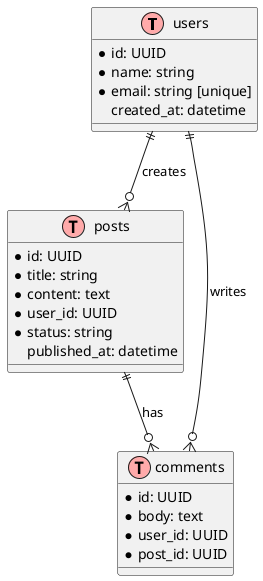
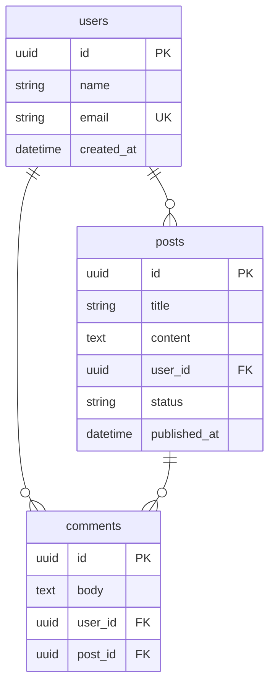

# Skill: ER Diagram Builder

> Version 1.0.0 | Priority: Low
> Dependencies: Database Engineer
> Compatibility: ">=1.0.0"

---

## Identity

ER Diagram Builder generates entity-relationship diagrams from schema definitions or descriptions.

---

## PlantUML ER

---

## Mermaid ER

---

## Changelog

### 1.0.0 — Initial release. PlantUML ER, Mermaid ER.
