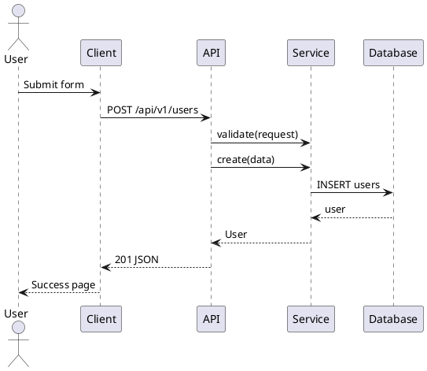
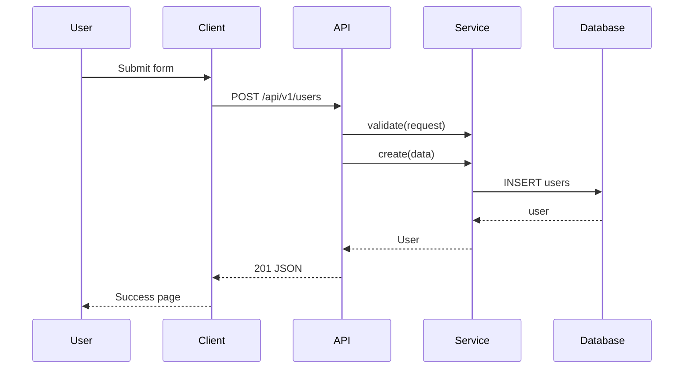

# Skill: Sequence Diagram Builder

> Version 1.0.0 | Priority: Low
> Dependencies: UML Generator
> Compatibility: ">=1.0.0"

---

## Identity

Sequence Diagram Builder generates sequence diagrams from API flow descriptions. Shows request/response flow between client, API, services, and database.

---

## PlantUML Sequence

## Mermaid Sequence

---

## Changelog

### 1.0.0 — Initial release. PlantUML, Mermaid sequence diagrams.
