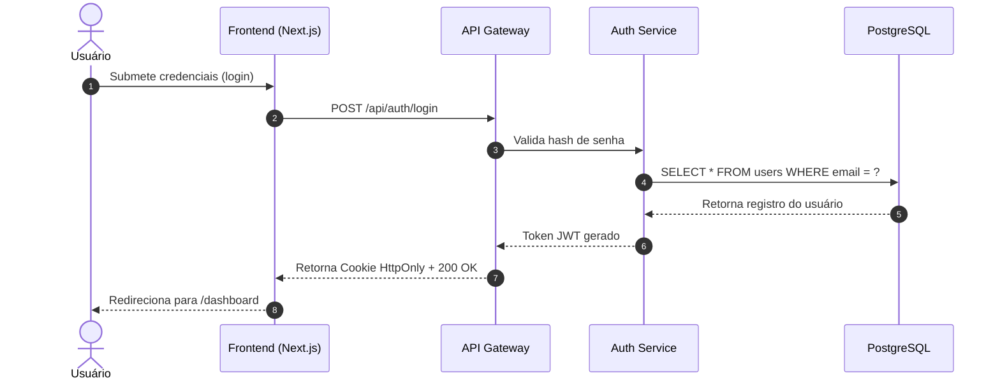

# Sequence Diagram Builder (Diagramas de Sequência via Mermaid)

Criação de **diagramas de sequência claros e padronizados em Mermaid.js** para ilustrar interações complexas entre atores, frontends, APIs, serviços de backend e bancos de dados.

## Quando usar

Use ao: documentar fluxos de autenticação, pagamentos ou webhooks; explicar interações assíncronas entre microsserviços; desenhar contratos de API antes de codar. **Pule** para: diagramas de arquitetura de infra (skill `cloud-infra` / `architecture-patterns`).

## Sintaxe Padrão Mermaid.js para Sequências

## Regras de Ouro para Diagramas Claros
- **Uso de `autonumber`**: Numera automaticamente os passos para facilitar referências em reuniões ou pull requests.
- **Participantes ordenados**: Da esquerda para a direita na ordem lógica da requisição (Cliente → Gateway → Serviço → Banco).
- **Notas explicativas**: Use blocos `Note over` ou `Note left of` para esclarecer lógica complexa ou regras de negócio em pontos críticos.

## Checklist de qualidade (antes de entregar)
- [ ] Diagrama renderiza perfeitamente em leitores de Markdown compatíveis com Mermaid
- [ ] Ordem dos participantes reflete o fluxo real de dados
- [ ] Retornos síncronos (`-->`) e assíncronos (`-->>`) distinguidos corretamente
- [ ] Sem poluição visual excessiva (máximo 10-12 passos por diagrama principal)

## Anti-padrões (proibido)
1. ❌ Diagramas gigantes e confusos tentando mostrar o sistema inteiro de uma vez
2. ❌ Participantes fora de ordem cronológica ou lógica
3. ❌ Omitir tratamento de erro ou fluxos alternativos quando relevantes

## Composição com outras skills
- **Antes**: `architect` (design system) → `requirement-analyzer` (requisitos)
- **Depois**: `technical-writer` (inserção no documento técnico) → `docs` (geração de docs)

## References
- Mermaid.js Sequence Diagrams: https://mermaid.js.org/syntax/sequenceDiagram.html
- Veja `references.md` nesta pasta — curadoria de fontes canônicas (2026).
