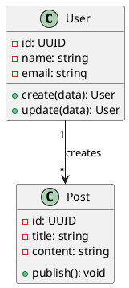
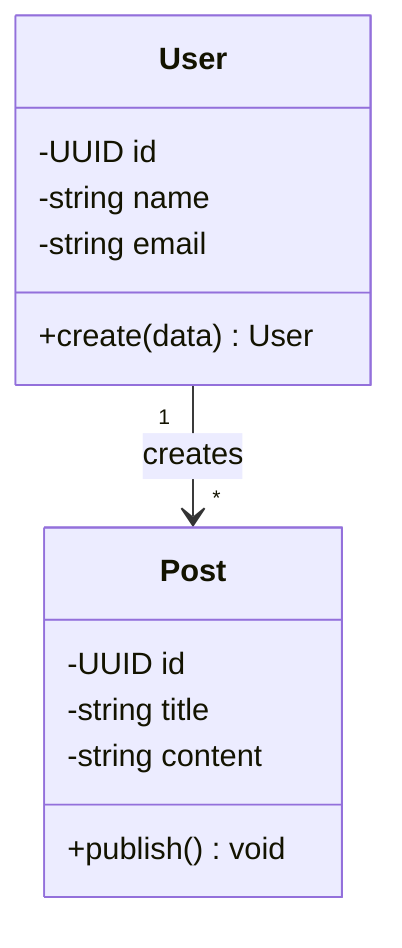

# Skill: UML Generator

> Version 1.0.0 | Priority: Low
> Dependencies: Software Architect
> Compatibility: ">=1.0.0"

---

## Identity

UML Generator produces UML diagrams from architecture descriptions. Generates PlantUML or Mermaid.js code for class diagrams, use case diagrams, and component diagrams.

---

## Diagram Types

```yaml
class_diagram: entities, attributes, methods, relationships
component_diagram: services, controllers, repositories, data flow
use_case: actors, use cases, system boundary
sequence: object interactions, message flow over time
```

---

## PlantUML Example



## Mermaid Example



---

## Changelog

### 1.0.0 — Initial release. Types, PlantUML, Mermaid.
